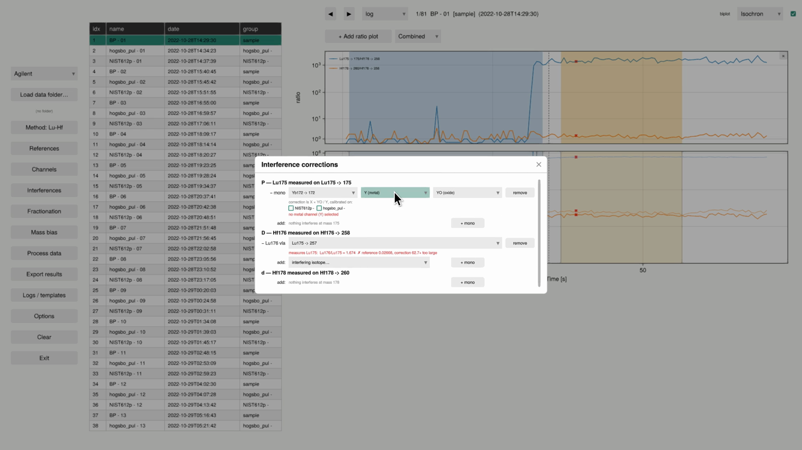

# KJgui

## GUI for KJ

[KJ](https://github.com/pvermees/KJ.jl) is a free and open data
reduction software package for LA-ICP-MS written in
[Julia](https://julialang.org/). KJgui is an extension that provides a
graphical user interface to KJ.

## Installation

KJgui tracks development branches of Makie and KJ, so install them
together. Enter the following at the Julia console (a.k.a. REPL):

```julia
using Pkg
pkg"add ComputePipeline#sd/breaking-gui Makie#sd/breaking-gui GLMakie#sd/breaking-gui https://github.com/pvermees/KJ.jl https://github.com/pvermees/KJgui.jl#sd/makie-gui2"
```

Requires Julia >= 1.10 and a GPU with OpenGL 3.3 (or `Xvfb` when running
headless).

## Minimal working example

```julia
using KJgui
KJgui.run_gui(path = "path/to/data")
```

`run_gui` opens the dashboard on the given folder of instrument files.
Omit `path` to start empty and pick a folder with **Load data folder...**.

From there: choose a decay system under **Method**, tag reference
materials by clicking a row's `group` cell, add ratio plots, adjust the
blank/signal windows by dragging on the time axis, set isobaric
**Interferences**, and hit **Process data** to fit.

## Walkthrough

[](assets/walkthrough.mp4)

A [recorded run through the dashboard](assets/walkthrough.mp4) (click the
image to play): loading a folder, switching decay system, grouping the
reference materials, adding ratio plots, dragging the blank/signal windows,
configuring poly- and mono-isotopic interference corrections, and
processing.
