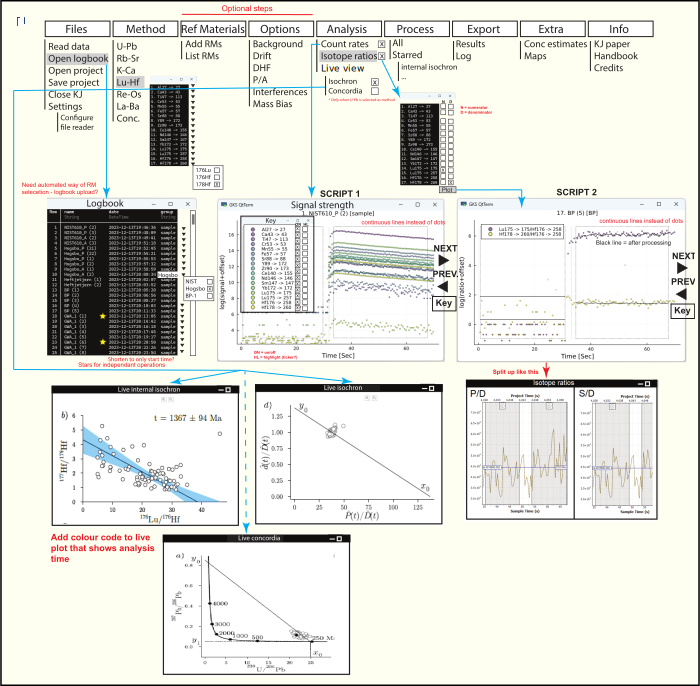
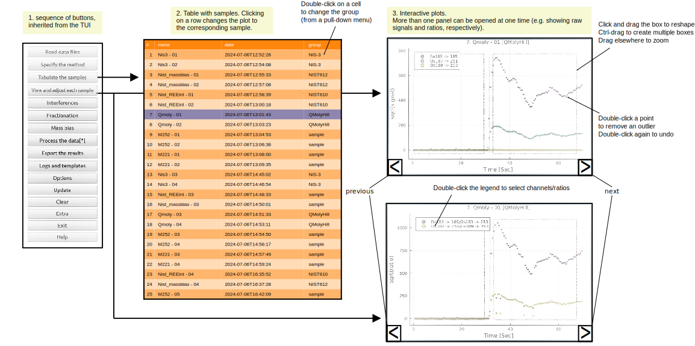

# KJgui roadmap draft (written by SG, edited by PV)

The purpose of the GUI is to design a user-friendly visualisation and analysis tool for data reduction using the KJ algorithm. This is how we foresee the program to work (with simplicity in mind).

At start-up, a menu bar appears with roll-out menus. The order of the menus reflect the order of the processing steps.

## Data Entry

Under "Files" (could be renamed), the user selects "Read data files", which would open Explorer (or equivalent) to select the required csv files. Note that different instruments produce different file types, so there may be a need to ask the user first which instrument was used to define the file type.

To define the order of analysis, time stamps in the files are used. The "settings" -> "Configure file reader" allows to change how files are ordered.

Other menus: "Open project", "Save Project", "Close KJ" are trivial. It would be good if intermediate work can be saved in case of program crashes.

After the files are read in, the "Open Logbook" function opens up the samples list (table organised by analysis time). Here, reference materials can be defined (see roadmap figure) by manual selection. Ideally, there is an option to "Add a logbook" (which can be exported from the laser instrument) to automate this process. Samples can be starred for independent processing (see later). The logbook window can be opened and closed at any time.

## Method selection

The Method menu lists available decay systems that can be used in KJ (this list should be expandable for future application). When selecting a method, a list appears with channels that reflect all measured isotopes (these are the column headers of input csv files). Using the drop-down arrows, the user can select which channel corresponds to which isotope. What needs to be defined here are: P (parent isotope), D (daughter isotope) and S (sister isotope). P, D and S are dependent on the selected method. In the example from the roadmap, Lu-Hf is selected and P = 176Lu, D = 176Hf, d = 177Hf.  Note that it is sometimes beneficial to select a different isotope as a proxy for d (e.g., b = 178Hf as a proxy for d = 177Hf). There are several examples of this in KJ.jl's documentation.

## Ref Materials (RMs)

This menu is purely here for the user to see which reference materials are available and to potentially add new ones. However, this could be omitted as RMs are selected in the logbook directly. We just need a space to allow new RMs to be defined.

## Options

As the word says, optional features, but for some methods, they can be important requirements. "Background", "Drift" and "DHF" allows the user to select different regression types to calculate the background, signal drift and down-hole fractionation, respectively. Background needs to be subtracted by KJ and is based on the first set of rows in each csv file (typically 30s of data). Drift is calculated based on the normalised count rate variation in RMs over time. DHF is the variation of isotope ratios as a function of the laser drilling deeper in the sample. KJ handles these operations, but here the user can change some fitting parameters.

"P/A" refers fto Pulse/Analog conversion factor. This factor is calculated from the instrument (can potentially be defined for every measured isotope, as it is slightly mass-dependent). The idea is that the user types in this value, which allows KJ to calibrate different detector modes independently. The P/A should also be displayed as a solid horizontal line in the signal strength window (next step).

"Interferences" refers to interfering isotopes that need to be calculated and subtracted from either P or D (method dependent). These only apply to some geochrononometers. Interference corrections can be complex (especially for Re-Os dating) and should be discussed at a later stage of KJgui's development.

"Mass bias" refers to a bias factor between different isotopes of a same element. When using a proxy isotope for an unknown P or D, the mass bias between this proxy isotope and P or D needs to be defined. For example, we use 185Re to calculate 187Re. The mass bias between these two isotopes is measured in a material that only has Re (or no interferences) at high count rates. The mass bias correction uses an exponential fractionation law that would take too long to explain here. At this point of KJgui's development, it suffices to know that KJ.jl has API functions for it. We can discuss the user interface for these functions towards the end of the project.

## Analysis

View is also a good title here, but the user will do more than viewing, they will also select which parts of the signals are used further in processing. The roll-out window has different options for interacting with the data, all of which should be able to be viewed simultaneously. If the user defines a selection window or outlier in one window, this needs to be automatically shown in the other windows. While many windows can be generated, it would be good to think about a useful way to organise these windows on the screen (make them lockable such as in windows?).

"Count rates" opens the "signal strength" window (can rename both to the same name). Here the column data in the csv files is displayed as lines of count rates of each isotope over time. SCRIPT 1 shows how this can be generated in KJ. The window should have a button to open a key, where channels can be switched on or off and highlighted (ticker lines). It also needs a navigation tool to quickly go through samples (data files). This is shown by the NEXT and PREV buttons. Importantly, selecting (highlighting) in the logbook should be a quick way to move through samples as well.

"Isotope ratios" opens a window where channels can be selected as either numerator (N) or denominator (D). Once selected and "Plot" is clicked, a new window appears, plotting the ratio of the selected channels. Multiple windows can be generated and typically 2 windows will be used (P/D and S/D). Functionality with navigation is the same as for "count rates" and the sample displayed should be the same for all open view windows. SCRIPT 2 shows how the ratio plot shown in the roadmap figure was generated. It would be nice if there was an option to have separate windows for each ratio instead of combining them (see roadmap figure).

For Both "Count rates" and "isotope ratios": It would be good to have a function to change the y-axis from linear to log scale (or other) and if possible, it would be nice if the user can zoom in on the signals with the mouse scroll button (or another way to easily zoom in and out of each signal). When opening or changing samples, it would be good if the zoom level is defined based on the data (such as the split up version of the isotope ratios in the roadmap figure). However, the user should have the ability to zoom in and out. If isotope ratios approximate detection limits, the detection limit should be displayed as a solid line to warn the user.

KJ automatically selects the full signal and background windows (displayed by dashed boxes in the figure). The user needs to be able to easily change the selection of the signal window on a sample by sample basis by dragging the selection window across the signal. If the selection window needs to be split into two or more windows (to crop out inclusions / outliers), perhaps a shortcut keyboard function should be held (or other easy way to rapidly adjust windows). The window selection needs to be reflected across all open view windows, including the Biplots (below).

The "Live view" function can generate two types of plots: "Isochron" vs "Concordia". The latter is only relevant to the U-Pb method. For Isochron, P/D (x-axis) is displayed as a function of S/D (y-axis). Each dot is a time step also displayed in the other view windows. The KJ manuscript contains basic examples of these plots, with links to the correponding Plots.jl code. The symbols should have a colour code that reflects their time of analysis (gradual colour change). By clicking outliers, they can be removed from the data cloud. When a point is removed, the selection windows in the other plots need to automatically respond to display the same information. Ideally, the x-axis also shows an age axis (which is a function of the P/D ratio and method dependent; so two x-axes simultaneously shown). After processing (see next step), it would be nice to display the mean value in the data cluster as an error ellipse OR a regression line as internal isochron.

## Process

This gets KJ to calculate and can be done differently for starred vs non-starred samples.

## Export

Here the results can be exported as a csv file (KJ output) as well as the log that captures every operation the user has done prior to exporting.

## Extra

to be discussed later

## Info

links to literature / github pages. Credits is an acknowledgement box.

## SG's Mock-up

# PV's additional thoughts

The layout proposed by Stijn is sensible and similar to the LADR software that he currently uses. I will sketch an alternative layout that stays closer to KJ.jl's existing TUI. This alternative layout would consist of three basic elements:

1. A set of buttons corresponding to the actions of the TUI.

2. An interactive table, with double-clickable groups, which can be used to select and define samples and reference materials for plotting and analysis.

3. An unlimited number of zoomable plot windows, with interactive selection boxes and plot keys. All plots are synced with each other.

Note that SG's layout contains exactly the same elements, but just shuffles them around. Perhaps the "TUI-inspired" GUI can be used as a stepping stone towards SG's GUI? Or perhaps we can give the user the choice between both of them?

